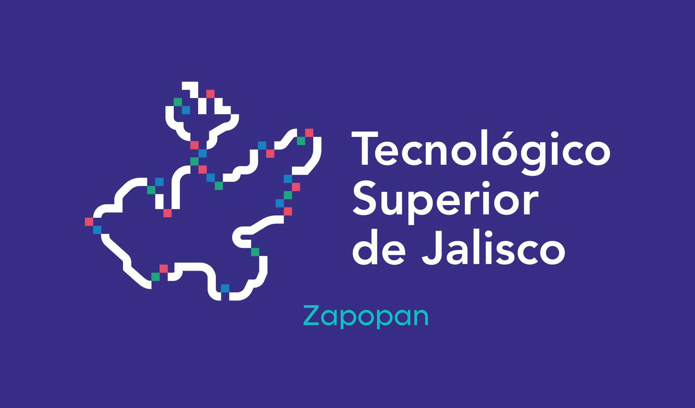

- # Tecnologico Superior de Jalisco  Unidad Academica Zapopan

---

> **Portafolio de Evidencias / Entregable de
 Clase**

## Informacion del Estudiante y Asignatura

| Campo | Detalle |
|:--- | :---|
| **Institucion** | **TSJ Unidad Academica Zapopan**|
|**Alumno** | **Karol Fernando Arce Lopez**|
|**Materia** | **Programacion Estructurada**|
|**Semestre** | 3.° Semestre |
|**Periodo Lectivo** | Ago - Dic 2026 |

## Indice de Unidade de aprendizaje

- **[Unidad 1: Introduccion a la Algoritmia y Diagramas de Flujo](./unidad1/pseudocodigo_04_10/)**
- **[Unidad 2: Introduccion a la Algoritmia y Diagramas de Flujo](./unidad1/pseudocodigo_04_10/)**
- **[Unidad 3: Introduccion a la Algoritmia y Diagramas de Flujo](./unidad1/pseudocodigo_04_10/)**
- **[Unidad 4: Introduccion a la Algoritmia y Diagramas de Flujo](./unidad1/pseudocodigo_04_10/)**
- **[Unidad 5: Introduccion a la Algoritmia y Diagramas de Flujo](./unidad1/pseudocodigo_04_10/)**
- **[Unidad 6: Introduccion a la Algoritmia y Diagramas de Flujo](./unidad1/pseudocodigo_04_10/)**
